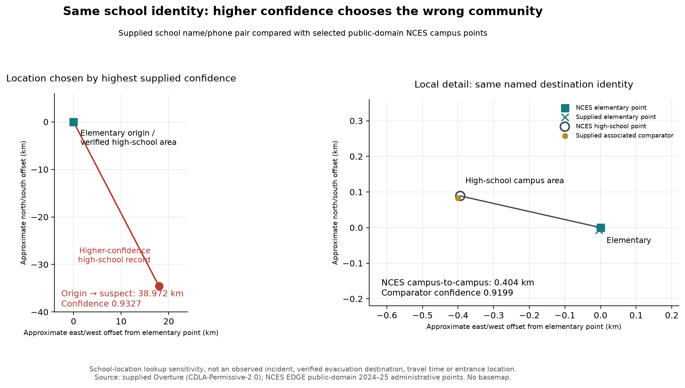

# Best Bias Discovery — Facility identities assigned to the wrong rural communities

**Participant:** tomfng · **Version:** 0.6, 7 October 2026 · **Associated accepted numerical entry:** `2cQVvovS` · **Status:** publicly published for consideration; valid award delivery awaits organiser confirmation.

[Public methodology post](https://zindi.world/competitions/bias-bounty-mapping-equity-challenge/discussions/35243) · [Fixed review archive](https://github.com/Nike232/mapping-equity-discovery/releases/tag/v0.6) · [Publication and reproduction record](https://github.com/Nike232/mapping-equity-discovery/blob/main/DELIVERY.md). Publication metadata is updated here; findings and frozen numerical evidence remain v0.6.

## Finding

Nine selected school identities in the supplied Overture `2026-08-19.0` data have points **17.395–544.008 km** from independently matched NCES administrative campus locations. All nine suspect points have confidence >0.9 and fall in rural tracts. Eight identities also have a supplied campus-area or associated-page comparator **7–55 m** from NCES. Four suspects are their tract's only school label; individually quarantining them changes the recorded count **1→0**. Zero labels does not establish no real schools.

The automatic coordinate diagnostic flags **24 school-labelled points at exact Web Mercator grid nodes**, 20 rural/four urban. Flag prevalence is **18.2 times** higher in rural than urban school records, or **17.9 times** within first-source Meta records. Seven flags have corroboration: six independent school-location conflicts and one district-address conflict. Seventeen remain candidates. These are flag ratios, not rural error rates or estimates of a provider's causal effect.

The contribution is a **local identity/location integrity problem inside an aggregate stratum**, with an exact coordinate review cue and sensitive local-presence decisions. It is not a new claim that positional accuracy generally matters. Neither organiser targets nor the five official scorecard metrics are reconstructed.

An independently registered fire-protection district supplies a direct emergency-institution case: its shared HQ address is corroborated near one supplied point, while the rural point is **6.534 km** away and constitutes that tract's sole fire label. The intervention is to verify local assets before using the point as a response/staging base.

## Impact: emergency-asset verification and school-location lookup

### Oak Cliff: an independently registered fire department on the wrong side of a 6.5 km location conflict

USFA's official National Fire Department Registry identifies **Oak Cliff Fire Protection District**, Oklahoma **FDID 42011**, as a local, mostly volunteer department. Its HQ address **13425 S Bryant AVE, Edmond OK 73034-8110**, and phone **405-340-9115**, match both supplied Station 1 records. This supplies independent institutional-role and HQ-address evidence, rather than inferring emergency use from a school category. The registry is retired; its download page says records were added/changed **before June 2026**. It validates a registered department and reported headquarters address, not present activity or the geometry of numbered Station 1.

The Census public geocoder returns one match for that **previously selected supplied address**, standardized as **13425 S BRYANT RD, EDMOND, OK, 73034**, at **−97.460511208045, 35.740543829922**. The rural suspect is **6.533986 km** from this independent address-range interpolation; the supplied urban comparator is **0.120234 km** away. The AVE/RD suffix difference remains visible. Addresses within a range can include numbers without actual structures; the result does not certify a station building or entrance.

| Supplied Station 1 record | Tract / confidence | Independent address-distance | Existing road consistency |
|---|---|---:|---|
| `2e36387b-2cd4-40c6-9e05-3cdc293d772d` | Rural `40083600802` / 0.950 | **6.534 km** | Western/Simmons area, not the shared Bryant address |
| `e4c428e3-3960-462f-97c4-0c020b226ac2` | Urban `40083600801` / 0.920 | **120 m** | 24.2 m from supplied South Bryant Road |

This corroborates the **Bryant-area location** independently of the two supplied points. It does not identify an exact true tract: the interpolated address falls in Urban `40083600401`, while the supplied comparator is in Urban `40083600801`. They are only 120 m apart and cross a tract boundary. Neither proxy is a surveyed station point; declaring either tract the verified station tract would overstate the evidence.

The concrete resource-planning decision is whether to count this Station 1 identity as a local response/staging base in Rural `40083600802` (population 4,415, SVI 0.1996). Its sole fire label instead identifies a department with a contradictory Bryant HQ address. Quarantining that location changes **one label to zero**, and should trigger local asset verification before staging or mutual-aid mapping. It does not remove the department, establish no fire service, delineate its service area, or prove an actual misdispatch or delay. This is a specific registered emergency institution and measured asset-location contradiction, with a practical correction priority.

The [USFA download](https://apps.usfa.fema.gov/registry/download) supplies one selected institutional record; [Census geocoder documentation](https://www.census.gov/programs-surveys/geography/technical-documentation/complete-technical-documentation/census-geocoder.html) explains the address-range limitations. [station_address_results.json](station_address_results.json) preserves original IDs, both distances, the register fields and the differing tract proxies. The new core uses neither proprietary incident records nor the copyrighted school safety plan.

### Happy Camp: higher confidence favours the wrong rural community

The supplied Happy Camp High School records `61281033-1be5-4ac5-8f3e-5a410a791fff` and `249bb167-b742-4eb0-a38d-96e6476f84c6` share school name, locality, ZIP and phone, with similar street-address text. They should not be treated as two distinct school campuses. Their locations disagree:

| Supplied identity record | Confidence | Distance to matched NCES high-school point | Tract |
|---|---:|---:|---|
| Suspect `61281033-1be5-4ac5-8f3e-5a410a791fff` | **0.932721** | **39.235 km** | Rural `06093000800` |
| Associated comparator `249bb167-b742-4eb0-a38d-96e6476f84c6` | 0.919912 | **9 m** | Rural `06093001300` |

**Selecting highest confidence chooses the contradicted location.** A ≥0.93 threshold, used here only as an illustration, keeps the suspect and drops the campus-area comparator. The comparator links a school apparel page; it corroborates the area, not a separate campus or surveyed entrance. Exact school ID `063694006277` supplies independent public-domain address and location evidence for **234 Indian Creek Road, Happy Camp CA 96039**.

Using Happy Camp elementary as a concrete nearby origin makes the lookup consequence visible. NCES elementary identity `061653002087`, **114 Park Way**, is **0.403777 km** from the high-school administrative point but **38.972469 km** from the suspect. With the supplied elementary point `f22af2bd-6e41-4b50-875b-6ea17ade8014`, the distances are **38.968 km** to the suspect and **0.407 km** to the associated comparator. The supplied elementary point is 7.8 m from NCES. All are straight-line comparisons, not bus routes or travel times.



The elementary origin and independently corroborated high-school point fall in Rural tract `06093001300`, population **2,529**, SVI **0.8333**. The suspect is in another Rural tract, `06093000800`, population **3,370**, SVI **0.7052**. NCES reports 79 elementary and 41 high-school pupils in 2024–25. These figures describe institutions and communities, not affected-person counts or catchments.

For an evacuation-planning or family-reunification map that first resolves a school identity, confidence-only selection can attach that institution to the wrong community before facility suitability is checked. The immediate decision is **which location to verify**, not which campus to designate. Retain the identity, quarantine the contradicted point and verify current location and suitability with the responsible institution. This open-source core does **not** establish any school's evacuation designation, current shelter eligibility, an actual misdirected vehicle, delay, capacity or harm. Emergency use is a hypothetical application of the measured lookup failure.

### Five sparse rural inventories lose their sole relevant label

| Identity | Suspect tract | Population / SVI | Independent discrepancy | Relevant label count before → after |
|---|---|---|---:|---:|
| Johnson High School | `48047950100` | 2,236 / 0.9109 | 342.216 km | School **1→0** |
| Seagoville Middle School | `48257051201` | 3,817 / 0.7641 | 36.407 km | School **1→0** |
| Meadows Elementary School | `48099980000` | 35 / unavailable | 27.261 km | School **1→0** |
| Lakeview Elementary School | `48319950200` | 1,784 / 0.2778 | 544.008 km | School **1→0** |
| Oak Cliff Station 1 | `40083600802` | 4,415 / 0.1996 | 6.534 km to independent **address interpolation**; not a station survey | Fire **1→0** |

Counts are sensitivity of the supplied register to excluding one reviewed ID. They are not real service absence. For preparedness asset checks, a positive label in these tracts should become **“local inventory needs verification”**, rather than assuming the distant institution supplies a local campus or base. Schools are not automatically public shelters, and fire service areas do not follow tract boundaries.

Lakeview suspect `c5484503-726f-4b8c-9612-1a6965679451`, confidence 0.903349, is a zoom-9 grid node at **−99.140625, 30.751277776258**. Supplied school name, Canyon ISD URL, Amarillo locality, Lair Road and ZIP match NCES `481281006371`. The supplied street number **6409** differs from NCES **6407**, and no supplied phone is present; both limitations are retained. NCES lists 388 pupils in 2024–25. Its campus point is outside the supplied geometries, **544.008 km** from the suspect. No replacement external inventory or out-of-scope tract is inferred.

For Oak Cliff, two supplied Station 1 records share **13425 S Bryant Ave**, ZIP and phone. The higher-confidence rural point (0.950) is 6.512 km from the urban comparator (0.920). The supplied Overture roads put the rural point 89.2 m from South Western Avenue and 53.6 m from West Simmons Road, while the comparator is 24.2 m from South Bryant Road. Matching ±0.004° windows and EPSG:5070 are used. Shared address and road consistency favour the Bryant area; this is not a surveyed station position or evidence of misdispatch. No department website is needed for this comparison.

## Novelty: assignment within a stratum and confidence-selection failure

Three independently checked school conflicts are **Rural→Rural**: Johnson 342.216 km, Happy Camp 39.235 km, McCloud 17.395 km. Rural totals cannot identify which rural community owns an asset. Johnson's suspect-point tract SVI is 0.9109, while its matched campus tract SVI is 0.0361. Local assignment changes sharply while the broad urbanity class stays the same.

A confidence ≥0.9 filter retains all eleven reviewed suspects: nine independent schools, the district-address conflict and Station 1. Happy Camp additionally demonstrates a strictly higher-confidence contradicted location within its supplied identity pair. Both Happy Camp records have Meta first; this is a selected within-identity example, not a comparison of calibrated provider scores. Overture confidence concerns **place existence**, not location certification; provider values need not be calibrated comparably. Highest-confidence selection is our illustrative downstream policy, not an official Overture deduplication rule or a failure of its stated confidence contract. The main contribution remains grid-coordinate concentration, wrong-community assignment within Rural, and sparse inventory sensitivity. These are selected cases, not a success/failure rate for confidence or a complete error inventory. No claim is made that official scores remain unchanged, or that removing points improves main-board RMSE.

## Evidence: comparisons and denominators

| Independently matched school | Suspect → NCES | Nearest supplied comparator → NCES |
|---|---:|---:|
| Johnson, `480001013567` | 342.216 km | 48 m |
| Seagoville, `481623001353` | 36.407 km | 41 m |
| Meadows, `482566002874` | 27.261 km | 11 m |
| Happy Camp High, `063694006277` | 39.235 km | 9 m |
| McCloud, `063694006278` | 17.395 km | 44 m |
| Horse Heaven Hills, `530393000750` | 55.526 km | 7 m |
| Piner, `484008004549` | 28.202 km | 55 m |
| U.S. Grant, `402277001139` | 441.352 km | 24 m |
| Lakeview, `481281006371` | 544.008 km | No matched supplied comparator |

The eight original identities and newly selected Lakeview identity were matched by supplied metadata and NCES identity/address evidence before selective coordinate retrieval. NCES locations are **2024–25 administrative address geocodes**, not surveyed entrances or present incident data. Campus-associated FFA/apparel/alumni records are location corroboration, not additional campuses. Older phone/ZIP and current street-number disagreements remain visible. The nine campus enrolments total 8,648, excluding the elementary origin; this is context, not people harmed.

The school screen covers **24,512 records** within the latest **9,794 scored tracts**, using six primary school categories and excluding explicitly permanently closed records. Unknown status remains. Rural denominator is **5,278** with **20** grid flags; urban is **19,223** with **4**; unknown urbanity is 11 with none. Within first-source Meta, denominators are 4,784 rural and 17,122 urban, with the same flags. All 24 flags have Meta first; nine have confidence ≥0.9. No upstream process or causal error rate is inferred.

For longitude λ and latitude φ, use `x=(λ+180)/360`, `y=(1−asinh(tan(φπ/180))/π)/2`. Flag when both `x×2^z` and `y×2^z` are within `10^-6` of integers for some integer `z=1…18`; report the minimum zoom. Membership is a review cue, not an automatic deletion rule. Non-grid conflicts demonstrate incomplete detection. The separate emergency screen contains 4,387 labels, no analogous grid flags and 14 ≥5 km identity-pair candidates; only Station 1's same-address pair is reviewed here. Shared organisation phone alone can represent valid different stations.

## Reproduction and permitted sources

From the extracted review package, using Python 3.11:

```text
python -m pip install -r requirements-discovery.txt
python scripts/reproduce_discovery_v06.py
```

The runner verifies and, if absent, downloads **16 documented current challenge Parquets (403,578,493 bytes)**. The bundled sample supplies text GEOID scope only; zero score placeholders are not labels. Frozen NCES, Census address response and selected USFA record permit default numerical reproduction without external agency API queries. Open-source DuckDB spatial, pandas, numpy, requests and matplotlib regenerate the measurements. The existing v0.4 recipe completed successfully; v0.5 and the new station-address stage reproduced from frozen responses. No fresh-environment/network-download test or redundant complete rerun is claimed.

Challenge inputs are current Overture POIs/roads, tract geometry and allowed strata fields for GEOID, urbanity, population and SVI, with original tribal/burn-probability context. No withdrawn reference layer is used for scored predictions, reference inventory reconstruction or organiser components. The new **Discovery-only single-address interpolation is openly documented as MAF/TIGER-derived**; it does not download/count a TIGER road layer or create a facility-reference inventory. Public-domain [NCES CCD/EDGE](https://nces.ed.gov/arcgis/rest/services/CCD/CCD_Data/MapServer/0) supplies only selected identities, address points and enrolment **for Discovery**, never scored predictions. Metadata explicitly state public-domain status. Original eight-ID query was retrieved **7 October 2026 12:04:42 UTC**, and the three-ID addition **12:40:36 UTC**, following a no-geometry identity query.

Frozen parameters, response hashes and retrieval times are in `runs/discovery_strengthening_v0.4/external_provenance.json` and `runs/discovery_strengthening_v0.5/external_provenance.json`. [Combined comparisons](../discovery_strengthening_v0.5/independent_location_results.json), [Happy Camp identity results](../discovery_strengthening_v0.5/happy_camp_identity_results.json) and [Lakeview results](../discovery_strengthening_v0.5/lakeview_case_open_sources.json) retain original IDs and the open-source-only comparisons. Challenge URLs/hashes are in `runs/discovery_scope/provenance.json`; fire evidence is in `runs/discovery_emergency/oak_cliff_case.json`.

New sources, retrieved 7 October 2026, are documented in this folder's [external_provenance.json](external_provenance.json): the one Census geocoder response (benchmark `Public_AR_Current`, ID 4), and the exact state/FDID-selected USFA record. Full source download URL/size/hash and the retained subset hash are recorded; only 11 institution fields for one department are retained, with no station counts, personnel or coordinates. [Census explicitly describes TIGER geospatial data as public domain](https://www.census.gov/newsroom/archives/2014-pr/cb14-208.html). [FEMA's publication/reuse policy](https://www.fema.gov/about/website-information) lists USFA among its official sites and permits copying/distribution of copyright-free material, with exceptions for credited restricted content. No separate copyright notice was observed in the official registry CSV; [fema_reuse_policy.json](fema_reuse_policy.json) records the specific basis and attribution. We make no blanket assumption that all `.gov` content is public domain and no agency endorsement claim. NERIS's separately governed contractor dataset is not used.

This core relies on openly licensed challenge data, public-domain NCES/Census geospatial results and the official USFA register under the recorded FEMA publication/reuse policy. Historical safety PDFs and current school/department webpages are excluded as evidence dependencies and establish no historical evacuation role here. The separate contextual research draft remains outside this core until its source terms are resolved.

Preserve attribution and source terms: Humane Intelligence / Zindi / Radiant Earth challenge CC-BY-SA 4.0; © Overture Maps Foundation and per-record CDLA-Permissive-2.0 providers; OpenStreetMap contributors and road-derived ODbL obligations; Census, CDC/ATSDR SVI, USFS; NCES public-domain records; USFA/FEMA National Fire Department Registry. The source README and metadata are bundled. Codex assisted development/writing; reproduction requires no proprietary model or paid API.

## Entry and delivery

Associated accepted numerical entry **2cQVvovS**, all-zero baseline, public RMSE **0.107246299**, has its separate code/methodology bundled. No external evidence enters it or later main-board experiments. No award score or prize is claimed. With explicit participant authorisation, this methodology and its public repository/release were published. [Discussion 35243](https://zindi.world/competitions/bias-bounty-mapping-equity-challenge/discussions/35243) links them to the accepted entry and asks organisers to confirm receipt, eligibility, effective channel and timestamp.

The original release was published on 7 October 2026 at **21:40:07 Asia/Shanghai (13:40:07 UTC)**; the post action occurred at **21:44:37–21:44:38 Asia/Shanghai**. Its page displays 21:44 without an explicit zone label. The last publication check found 0 replies. **Valid award delivery and its tie-break timestamp remain unconfirmed.** The fixed ZIP retains the pre-publication snapshot; this current document updates delivery status only. [DELIVERY.md](https://github.com/Nike232/mapping-equity-discovery/blob/main/DELIVERY.md) records the original hash, pinned code and reproduction boundaries. Earlier publication matters for judging only if organisers recognise it as valid delivery.
